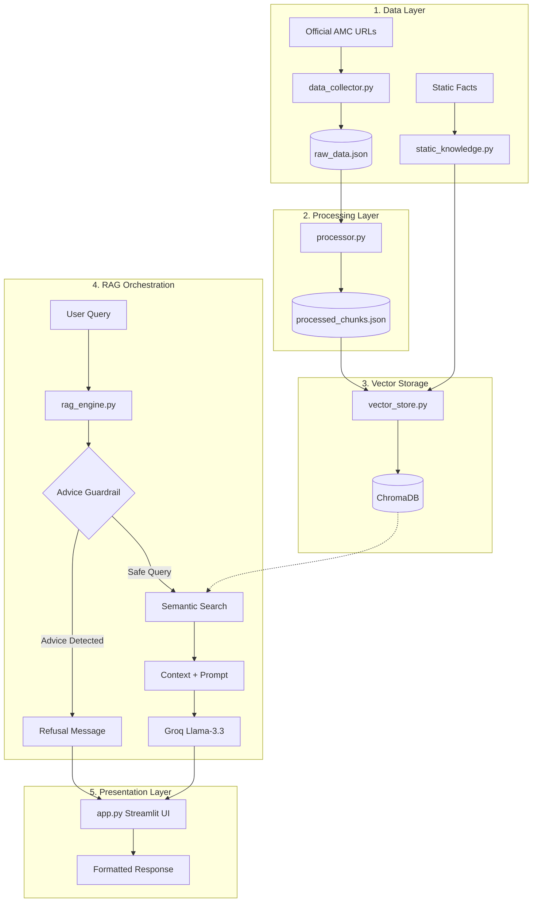

# Project Architecture: ICICI Prudential Fund Facts Assistant

A detailed breakdown of the system design, data flow, and technical implementation of the RAG-based factual assistant.

---

## 🏗️ High-Level Architecture

The project follows a **Modular RAG Pipeline** (Retrieval-Augmented Generation) without external frameworks like LangChain, ensuring lightweight execution and complete control over guardrails.

---

## 🧩 Component Details

### 1. Data Acquisition (`data_collector.py`)
- **Scraping**: Uses `requests` and `BeautifulSoup4` for targeted extraction. 
- **Content Filtering**: Filters out navigation bars, footers, and scripts to keep the knowledge base clean.
- **Limitation Handling**: Since some AMC data (like tables) is rendered via JavaScript, we use **`static_knowledge.py`** as a secondary "Gold Source" for critical missing facts (Expense Ratios, Inception Dates).

### 2. Custom Chunking (`processor.py`)
- **Strategy**: Manual text splitting by paragraph and character limit (1000 chars) with 100-char overlap.
- **Metadata Persistence**: Every chunk maintains a link to its original `source` URL, ensuring citations are always accurate.

### 3. Vector Brain (`vector_store.py`)
- **Database**: **ChromaDB** (Persistent).
- **Embeddings**: `SentenceTransformer("all-MiniLM-L6-v2")`. Selected for its excellent balance of speed and semantic accuracy on financial text.
- **Persistence**: Rebuilds the index from `static_knowledge` and `processed_chunks` to ensure data freshless.

### 4. RAG Orchestration (`rag_engine.py`)
- **Guardrails**: 
    - **Keyword Filter**: Intercepts advice-seeking phrases (*"Should I buy..."*) before they reach the LLM.
    - **System Prompt**: Enforces strict "Facts-Only" behavior.
- **Context Injection**: Dynamically injects the top-3 most relevant chunks into the LLM prompt.
- **Model**: `llama-3.3-70b-versatile` via **Groq** for high-speed, high-reasoning responses.

### 5. UI/UX Layer (`app.py`)
- **Custom CSS**: Dark-themed Groww aesthetic.
- **Responsive Logic**: Uses `clamp()` and media queries for mobile/tablet support.
- **Session Handling**: Maintains chat history and handles greetings ("Hi/Hello") without re-triggering the LLM for simple intros.

---

## 🚀 Future Improvements

### 1. Technical Enhancements
- **Hybrid Search**: Combine semantic search (ChromaDB) with keyword search (BM25) to better handle specific numerical queries (e.g., specific fund names or codes).
- **Reranking**: Implement a second-pass reranker (like Cohere or Cross-Encoder) to ensure the top-1 context is always the most relevant before LLM generation.
- **Evaluation Pipeline**: Use `RAGAS` or a custom test set to quantify query accuracy and faithfulness.

### 2. Data & Content
- **Dynamic Data API**: Integrate with real-time NAV APIs to provide today's exact pricing rather than static historical data.
- **Document Expansion**: Add PDF parsing for full Scheme Information Documents (SIDs) using `marker` or `unstructured` for better table extraction.

### 3. User Experience
- **Streaming Responses**: Implement `st.write_stream` for a "typing" effect to reduce perceived latency.
- **Feedback Loop**: Add a simple Thumbs Up/Down for answers to collect data for future fine-tuning.
- **Multi-lingual Support**: Enable support for Hindi or other regional languages, given the diverse Indian investor base.

### 4. Compliance & Security
- **PII Redaction**: Add a layer to redact sensitive user info (PAN, Mobile) before sending queries to external LLM APIs.
- **Citation Tooltips**: Instead of just links at the bottom, show "source snippets" on hover.
